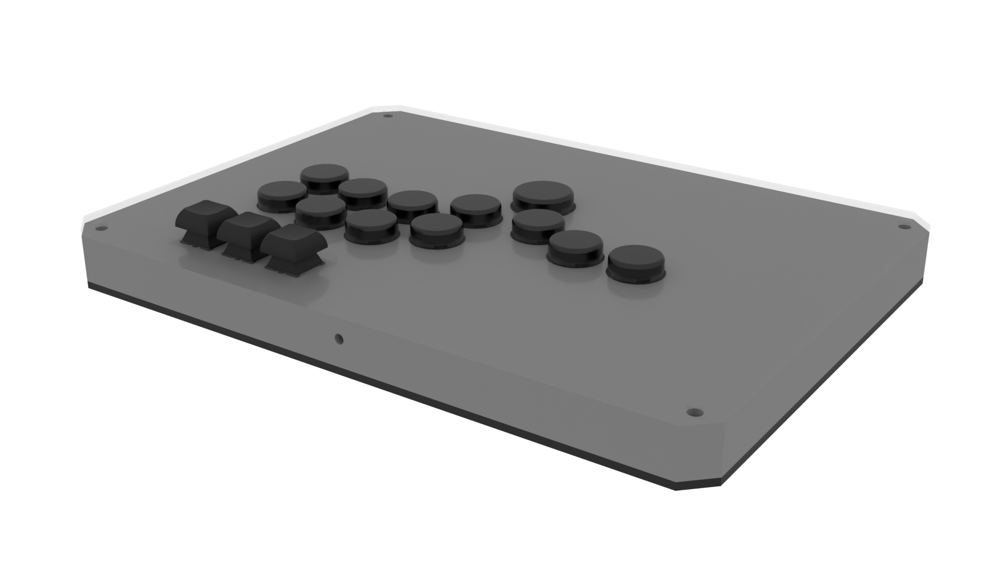

# G.O.B.L.I.N.
## Flat case and a good weekend project

> [!NOTE]
> This case is currently being remade from scratch. Stay tuned !

---

A Flatbox-style build in two flavors: WASD and Standard. Uses Cherry MX style switches, compatible with SiTong caps. Requires you to vaguely know how to operate both a 3D printer and a soldering iron.

The main difference with the OG Flatbox is that this is a bit chonkier, and uses regular keycaps for the options row.

## The Stats

**Printability**: 5/5 (very few supports, as long as you have a good bed level it should be a breeze)  
**Buildability**: 4/5 (you will need to have solid bases in soldering to get this done)  
**Extra hardware**: 4/5 (all of it can be easily bought online for cheap)
**Price**: 5/5 (it's about the cheapest controller I can make)

## Materials needed

- 4x M4 x 20mm "Chicago bolts"
- 15x MX-style switches
- (Optional) 15x MX-style hotswap sockets (in case you want to change your switches)
- 12x round caps (see below)
- 3x square keyboard caps
- 4x 200 by 3mm metal rods (either brass or steel to taste)
- A board capable of running GP2040-CE (I used a Waveshare RP2040-Zero)
- Wire (solid core && stranded)
- Wire strippers
- Soldering iron (preferably one with adjustable temperature)
- (Optional) Cuttable screw terminals, or Wago style terminals

## Printing

Print the chassis halves. Print the bottom pieces. Print the top pieces if that's what you want, or go get some acrylic laser cut.

I swear it's *that* straightforward.

## Building

Assemble the two top halves, using the rods for alignment and support. Put your outbound USB cable in the hole. Plastic weld or glue if you feel like it. Do the same for the bottom halves.

Insert all your switches in the square holes; they're friction fit. Save the caps for later.

Use the solid core wire to wrap hooks (or loops if you're really dextrous) around the pins of the switches. If you use hotswap sockets, you might need to strip some extra. Solder those hooks and go from pin to pin until you have grounded all your switches. (You don't need to ground them all on the same rail, it just helps if you have a limited number of ground pins)

At this point you have a couple of options, all valid:  
- Leave a length of solid core wire after you're done hooking everything up, connect it directly to a ground pin on whatever board you use
- Do the same but a shorter length, use a Wago or screw terminal, and continue your ground path to the board with a stranded core wire
- Directly wrap stranded core wire above/around the last ground pin in the chain and connect *that* to the board

Switch to stranded core from this point onwards.

Measure lengths of wire and strip one end (don't be afraid of overdrawing at the wire bank so to speak - it's best to measure twice and cut once than it is to try to splice bits of wire together afterwards). Solder that end into your board.Measure how long you need to go to a given switch pin, add a couple centimeters, strip the wire, and wrap it around the switch pin to solder it.

Now how you make the board communicate with the outside world (and hopefully with a host type device such as a PC or a game console) is up to you; there are a lot of boards and even more cables, panel mounted cables, breakout cables and so on, and I realistically can't cover every case.

I encourage you to closely inspect your wiring job at this point, and most importantly test it !

Once you're done, set the caps onto your switches. Support them from the back while doing so to avoid damaging your wires.

Place your art (optional) and the acrylic on your top panel. Add the Chicago screw barrels. Place the bottom plate and screw it in place.

Let the Ikea Effect wash over you for a couple minutes before hitting the lab.

## Button Caps

You pretty much have two ways of going about this:

- Obtain a set of SiTong 24mm caps; those are 20.6mm across and will fit perfectly (don't forget to get a 30mm one - which is actually 25mm across - for the Standard Leverless layout) , **OR**
- Print them yourself (PLA is not recommended although that depends on your particular brand; PETG is much better). [Rana-sylvatica's keycaps](https://github.com/rana-sylvatica/circle-keycaps/tree/main) are a good bet, but anything with a MX compatible stem that is less than 21mm across should be okay

## Acknowledgements

- [jfedor's Flatbox](https://github.com/jfedor2/flatbox) for being the OG inspiration
- [The GP2040-CE project](https://gp2040-ce.info) for being an awesome firmware and for their Discord server re-teaching me how to solder
