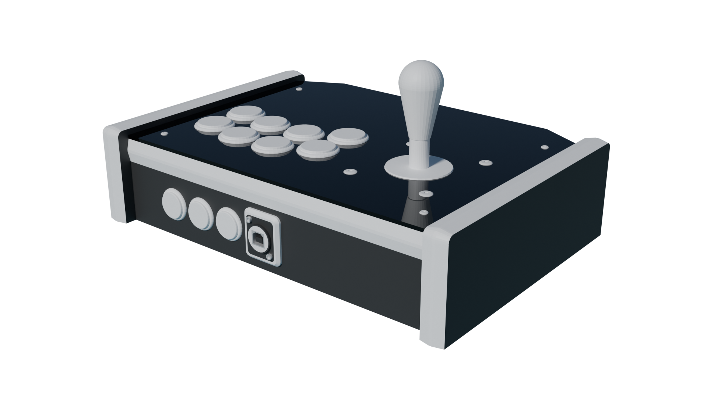

# O.G.R.E.
## American-style fightstick case

---

## The Lore

This case is based on the venerable Multi Arcade System by the legendary Thao Nguyen (may he and his wife rest in peace). There are major differences though, which is why I call it an American-*style* case, rather than being a straight tribute.

The first and most obvious is the building material. Original MAS sticks were made of thick MDF, and while it's a nice building material, it also weighs a ton. I'm pretty confident that any printable plastic, even at 100% infill density, will result in a case that is *far* lighter than any MAS ever was. (*Note: I don't actually have a MAS so if you have one and can prove me wrong I'd actually genuinely appreciate it*)

To preserve at least the spirit if not the letter, laser cut files are provided for additional wooden accents to be glued onto the frame. MDF or plywood should work nicely as long as it's 3mm thick. Even acrylic if you're feeling adventurous and decide to slice the "wings" without top and bottom surfaces so as to partially see inside the stick. But should you want to, you could also just print them in a different color from the end of the frame !

The second major difference, also rather obvious, is that I elected to not slope the control panel inwards. To be honest I couldn't find data on what angle should be used, and since I am going to use that as a lap stick anyway, I decided to forgo this part entirely.

Third big difference: The button layout has been adapter to something more hand-friendly (namely Sega 2P) and uses 30mm holes instead of the 28mm ones made for Happ-style buttons (including IL versions).

And the last difference: the build is a lot smaller than an original MAS (again done to be able to use it on my lap). The original is 40.64 x 25.40 x 12.7 centimeters, and this one is 32.8 x 23.2 x 7.8 centimeters.

## The Stats

**Printability**: 3.5/5 (the external walls/"wings" really suck and take way too much time to print, and every grooved part needs support due to orientation)  
**Buildability**: 5/5 (super roomy case that is very easy to put together and build in)  
**Extra hardware**: 4/5 (technically you could print the dowels using a truncated cylinder, but the square neck bolts is where it loses a point for real)
**Price**: 4/5 (eats about an entire roll of plastic to be willed into existence; not too bad but definitely the most expensive build I have on the roster)

## Parts list

Must be exactly matched:

- 28x 6x30 wood dowels
- 16x M3S Ruthex heat-set inserts (I haven't tested other ones, and I know *those* work)
- 1x Neutrik NA-USB
- 4x DIN 603/ISO 8678 M5x30 cup head square neck bolts (**THE SQUARE NECK IS IMPORTANT**)

Exact match not needed except for dimensions:

- 4x DIN 6923/ISO 4162 M5 hex nuts with flange (any M5 fastener will work but these are the ones I used)
- 4x ISO 7380 M3x8 hex socket button head screws
- 8x DIN 7991/ISO 10642 M3x6 hex socket countersunk screws
- 2x DIN 912/ISO 4672 M3x30 hex socket head cap screws
- 2x DIN 934/ISO 4032 M3 hex nuts

To taste:

- About a kilogram of filament (more if you wish to print accent pieces)
- Around 1m of T-molding, 19mm wide

Tools & auxiliaries:

- Soldering iron
- (Optional but recommended) A rubber mallet
- (Optional but recommended) Neoprene glue/contact cement. CA glue should work too
- (Entirely optional) Around 2 A4 sheets worth of 3mm thick material to laser cut
- (Entirely optional) One A3 size 3mm acrylic sheet for the top panel, also for laser cutting

## Build guide

> [!IMPORTANT]
> Currently the mounting points for the main board are misaligned.
> **I am aware of this.**
> If that is a problem for you, a temporary fix would be to use self-adhesive feet, but really you can pretty much leave the board hanging in there too. I will eventually fix this some day.

Start with the two main body halves and the support bracket, all located in the Common folder. Use five dowels (and glue if you have to) to join the halves. Add the heat-set inserts: 6 holes on the underside of the body, 2 in the support bracket, ~~4 holes on the right side to mount the board~~, and 4 holes on top to mount the acrylic.

Print both sides of the fender, and join them with one dowel. Add four more (and again, glue if you need to) then join it to the main body. This will also lock the main body permanently !

Add the T-molding to the main body. Use whatever you deem necessary to make it behave and slot in properly. Glue, clamps, heat gun -- anything is fair game.

Depending on whether you're going for accent panels or not, pick your wing model from the appropriate folder. The wings are symmetrical, so start with whichever side you find more convenient. Add dowels to the main body; if you're hammering them in, only hammer the 6 outer ones in since the 3 middle holes do not bottom out !

- If you're going for the layered approach: go for (glue) -> side with holes -> (glue) -> inner wing -> (more glue) -> outer wing -> t-molding
- If not, just slide it in and add your t-molding after

Screw in your top panel acrylic if you have one; add the square neck bolts to your top panel and secure them (if you already have the lever on hand, it's time to install it as well)

Add the Neutrik to the main body, then the support bracket

Print the bottom piece twice and screw it to the body.

## FAQs:

Q: Which levers are compatible with this ?  
A: This case is made for the Industrias Lorenzo Eurostick 2. For any other lever, you will need an adapter plate. I do not know *which* adapter plate though, sorry !

Q: Which buttons are compatible with this ?  
A: They should all be compatible. You might have trouble fitting Happ-style buttons without a shim (just a hollow barrel or ring, ID 28.1mm OD 29.9mm 3mm high if you wanna model one yourself)

Q: Can I print the parts that should be made of wood/acrylic ?  
A: Sure ! Contact cement works just as well to attach them.

Q: T-molding is a PITA ! Any suggestions to deal with it ?  
A: Frankly I used weak adhesive (read: regular school-grade glue) to make mine behave. If you have a heat gun that also works, just be careful to not melt the plastic !

## Acknowledgements

- The Nguyen family of course, for creating the MAS in the first place, and by proxy the very concept of fightsticks
- [Buttercade](https://www.etsy.com/shop/BUTTERCADE) for the Surround and Support project
