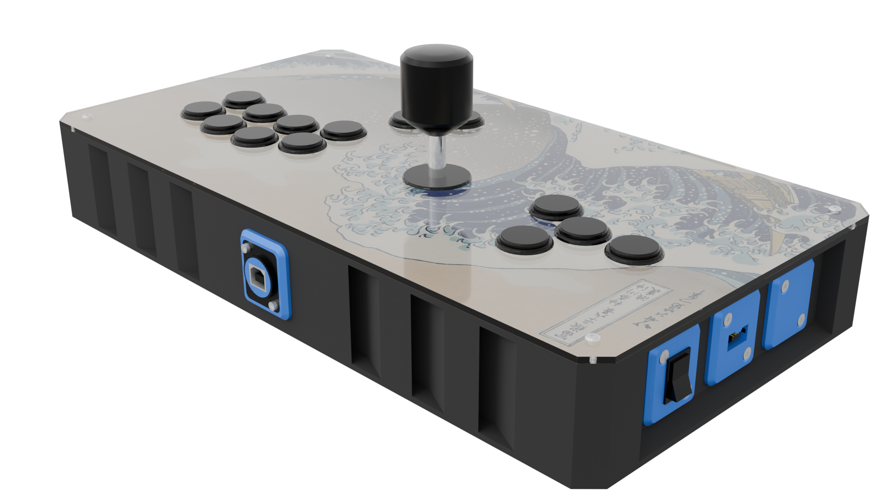

# Final Boss NEO
## Everything and the kitchen sink

---

This is a wider (but not larger) variant of the Ork, in order to allow for a "Mixstick"-type layout. Since someone once asked what kind of directional input I preferred, and I decided to answer "Yes", this also includes a Nunchuk port. Because at this point why not.

The lever is detachable (Phreakmods Link) and therefore does not interfere with the WASD cluster. Also I picked this particular, non-standard order (most hitsticks/mixsticks go lever - movement buttons - action buttons) for two reasons: the first being to more closely mimic my typing position as I'm mainly a leverless player these days. The second is that, simply put, putting too much space between the lever and action buttons tends to introduce discomfort and misinputs alike while using the lever.

This decision, however, came to bite me in the rear during the build. More info below.

The lever and WASD clusters aren't active at the same time in order to comply with an EVO rule that I can no longer find. The grounds of both are wired to a 3 pole single throw switch acting as a selector out of an abundance of caution - sure, a 3 pole double throw switch would have worked much the same, and allowed me to enable both input sources at the same time, but just to mitigate the risk of making a tournament organizer mad on the day of, I elected to go for mutual exclusion instead.

The Nunchuk has been configured to be purely analog, which therefore *should not* break the rule on redundant inputs (this is the same rule that makes the Cross|Up tournament legal if you're wondering)

## Parts list

Must be exactly matched:

- 20x M3S Ruthex heat-set inserts:
    - 8 for the bottom panels
    - 8 for the top panels
    - 4 for the acrylic
- 1x A4-sized 3mm thick sheet of material to laser cut for the top panel (acrylic, wood, brass...)

Exact match not needed except for dimensions:

- 4x ISO 7380 M3x5 hex socket button head screws for the acrylic
- 24x DIN 7991/ISO 10642 M3x8 hex socket countersunk screws:
    - 8 for the bottom panel
    - 8 for the top panel
    - 4 for the acrylic
    - 4 to mount the lever
- 4x DIN 7991/ISO 10642 M4x10 hex socket countersunk screws to mount the lever
- 2x DIN 912/ISO 4672 M3x30 hex socket head cap screws for the Neutrik
- 4x M3 washer
- 6x DIN 934/ISO 4032 M3 hex nuts

Tools && auxiliaries:

- Soldering iron
- (Optional but recommended) Neoprene glue/contact cement. CA glue should work too
- (Optional but recommended) Medium strength threadlocker, aka blue Loctite(tm)

If you wanna replicate my exact build:

- Angled USB-A to C cable (as low profile as possible on the A end)
- Seimitsu LS-32 (**SEE BELOW** - I heavily recommend not using this lever and using a Sanwa JLX instead)
- Phreakmods Link for the lever you use
- 17x Seimitsu PS-14-DN arcade pushbuttons
- 1x 3 pole single (or double if you're not paranoid about tournament rulesets) throw rocker switch
- 12x DIN 7991/ISO 10642 M3 hex socket countersunk screws for the accent plates:
    - 2x 35mm for the Nunchuk one
    - 4x 15mm for the rocker switch and the blank
    - 6x 5mm for the button plates
- 12x DIN 934/ISO 4032 M3 hex nuts
- 1x any board that runs GP2040-CE (I use the Advanced Breakout Board produced by Smallcab)
- 1x Brook wire harness
- 1x Adafruit Nunchuk breakout
- Extra wire
- Crimping tool & 2.8mm spade connectors (just buy like a pack of a hundred, it's always useful)

## Build guide

Print 4x corner pieces, long sides of your choice (my builds use 2 vented sides for the front and 2 blank sides for the rear), both short sides, top and bottom panels. Add the heat set inserts into the frame then join the frame pieces. Screw down the top panels.

> [!WARNING]
>
> So this is where I need to talk about the lever. Since all I had on hand was a Seimitsu LS-32 and I was *really* not feeling up to spending an extra 70€ on purchasing both a JLX and a Phreakmods Link, I figured I should roll with that.  
>
> Turns out the LS-32 is kind of a big boy and it gets in the way of whatever plugs into the Neutrik, on the inner side. Thankfully, I had a left angled USB-A to C cable (right-angled would work just as well) that barely clears the LS-32's body and allows me to mount everything properly. If you're using a JLX, you'll probably be fine. If you're using basically any Korean lever, good luck.

Screw the Neutrik connector in the front, plug in the cable, then mount the lever to see if the clearance is good.

Mount everything that goes on a Neutrik style plate to the case. For the buttons, the screws are purely decorative and they're secured to the case through their own nuts.

Disconnect the ground of the joystick harness, crimp a spade connector on its end, then connect it to the rocker switch.

Wire everything else. Remember to use a separate ground chain for the WASD cluster and for the rest of the buttons, as we'll need to feed that to the rocker switch.

Crimp another wire that you'll connect to the common terminal of the rocker (usually the middle one, but check your datasheet nonetheless) and ground that to the main board. Wiring the rest of the stick should be pretty standard fare - in case you wish to ask, you can use the harness for the lever and connect the WASD buttons through the screw terminals, or the other way around, it doesn't really matter.

For the Nunchuk breakout, print an extra plate to use as a brace. Slide the adapter into the groove, then screw the holder plate and the brace plate on (the first one prevents the board from moving vertically, the second horizontally)

Wiring the Nunchuk plate is kind of "to taste" and depending on what pins you have available. Check the GP2040-CE docs to know which i2c pairs you can use. Get 5v and ground from the screw terminals. If you can crimp a JST-PH connector you can also use the Expansion header normally used for the OLED display.

## The Stats

Printability: 5/5 (no tricky pieces at all)  
Buildability: 4/5 if you heed my warning and use a Sanwa JLX; 2/5 otherwise (and as someone who doesn't particularly like the JLX, this hurts to say)  
Extra hardware: 4/5 (the Nunchuk breakout might be the hardest part to get, which is really saying something)

## Acknowledgements

- [Buttercade](https://www.etsy.com/shop/BUTTERCADE) for the Surround and Support project
- [Junk Food Arcades](https://junkfoodarcades.com) for the Snack Box v2, which genuinely coincidentally happen to share a lot of general shapes with this project)
- [The GP2040-CE project](https://gp2040-ce.info) for the GP2040-CE firmware and its Nunchuk add-on
