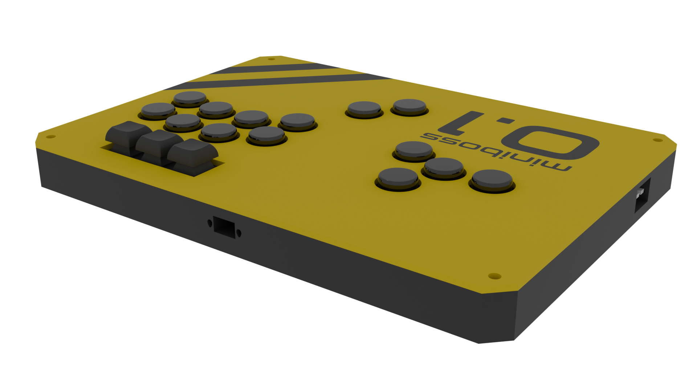

# Miniboss NEO

---

A variation on the Goblin build, adding two extra thumb buttons to a WASD layout alongside a Nunchuk port.

Originally I wanted it to have a standard acrylic plate && art (a 4K render of CTF-Face if you want to know), but at the time I completed this build, both my local printer and fablab were on vacation. Cue improvisation sequence.

## The Stats

Printability: 5/5 (very few supports, as long as you have a good bed level it should be a breeze)  
Buildability: 4/5 (it's basically identical to the Goblin, with four extra wires to deal with)  
Extra hardware: 4/5 (all of it can be easily bought online)

## Materials needed

- 6x M4 x 25mm "Chicago bolts"
- 17x MX-style switches
- (Optional) 23x MX-style hotswap sockets (way easier to solder to than bare pins)
- 14x round caps (see below)
- 3x square keyboard caps
- 4x 200 by 3mm metal rods (either brass or steel to taste)
- (Technically optional) 1x Adafruit Nunchuk breakout

## Printing

Print the chassis halves. Print the bottom pieces. Print the top pieces if that's what you want, or go get some acrylic laser cut.

I swear it's *that* straightforward.

## Caps

You pretty much have two ways of going about this:

- Obtain a set of 14 SiTong 24mm caps; those are 20.6mm across and will fit perfectly, **OR**
- Print them yourself (PLA is not recommended although that depends on your particular brand; PETG is much better). [Rana-sylvatica's keycaps](https://github.com/rana-sylvatica/circle-keycaps/tree/main) are a good bet, but anything with a MX compatible stem that is less than 21mm across should be okay

## Building

Insert the metal rods in the designated holes. Join halves and optionally plastic weld or glue them together.

Remove the supports from the button holes in the top panel halves and insert the switches and caps.

Solder. (Really that part is up to you including which board and cable you're going with)
