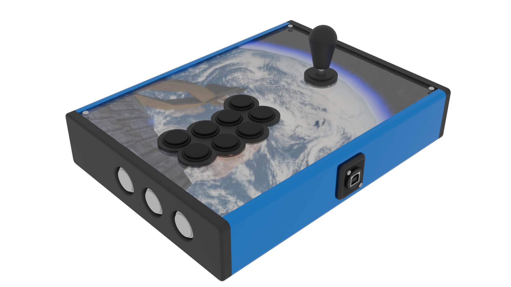

# R.A.I.J.I.N.
## ...A build. Most certainly.

---

A personal build because I *really* wanted to play with a full collar Korean lever again.

In other circumstances, I would call this a very simple, straightforward build. Because it's exactly that. Except...

## The stats

**Printability**: 5/5 (as straightforward as can be)  
**Buildability**: 5/5 (for my purpose anyway)  
**Extra hardware**: ...uhhhhhhhmmmmmm...  
**Price**: 4/5

## The elephant in the room

So if you've opened the STL files already, you might have noticed something that one would be inclined to describe as a pattern. If not, let me spoil you: This build requires **40** heat-set inserts and ~~just as many~~ even more screws somehow.

***FOURTY.***

Some people seem to not consider this a problem, and to be honest it *probably* isn't outside of my own head, but I personally find this number to be rather excessive - even if it does work, mind you ! You tell me if I'm overthinking this.

If you are too young to know what that art is, it's a legendary map from an equally legendary game that now allows you to play Fortnite.

## Parts list (buckle up)

No shortcuts this time: match these or go home !

- **40x** Ruthex M3S heat set inserts
- And 40x screws as follows:
    - 4x ISO 7380 M3x8 hex socket button head screws for the acrylic (can be substituted by machine head screws if you don't want to buy a bag of those to use only four)
    - 12x DIN 7991/ISO 10642 M3x8 hex socket countersunk screws for the top and bottom panels
    - 24x DIN 912/ISO 4672 M3x10 machine head screws for the frame
- And some more that don't have an inset counterpart:
    - 4x DIN 7991/ISO 10642 M3x16 hex socket countersunk screws with washers and matching nuts to mount the lever (or the same length in M4 with matching nuts if you don't want to use washers; you'll need to widen the hole manually though as it's M3)
    - 2x DIN 912/ISO 4672 M3x30 machine head screws with matching nuts for the Neutrik
- 1x 29 by 21 centimeters 3mm thick acrylic sheet

Tools and auxiliaries:

- Soldering iron (highly recommended if you intend for this build to go anywhere)
- Stiff drink
- Energy drink
- Stiff energy drink
- Size 2 and 3 hex wrenches or ball drivers depending on your personal preference

## Printing

Four corners, four brackets, four panel supports, two bottoms, one of each top half, left, right, and each cardinal direction (they correspond to the long sides but they're slotted to improve fitting)

## Building

Heat up your soldering iron. Crack your knuckles. Put on some lo-fi. We're here for a little while.

Place the heat-set inserts in all the relevant holes. I suggest doing this in one pass so that a) We're done with it, and b) The first inserts have the time to cool off and set-in by the time you finish.

Screw the long sides' halves together using the four brackets. Start adding the corner pieces using the machine head screws.

Screw in the short sides. Add the panel supports to them while you're at it (depending on how your printer's tolerances are tuned in, use either a rubber mallet, glue, or clamps to get this done)

Populate the top panels && acrylic and screw them in.

At this point we're entering the electronics zone, so this is where this guide stops !

## Post-mortem

I joke a lot in this README file but I don't actually think this is a bad build at all. In fact this might be one of my best IMO. I'm just very conflicted about the sheer number of screws required and whether or not it's "worth it" to someone who don't already have a ton of those laying around.

My version is actually a bit earlier than the one I published, and lacks the panel supports as well as the orientation markings. Seeing how that could rapidly get confusing I added those via ~~butchering the model~~ boolean modifiers.

Should you attempt to replicate my build, I do hope you like it, despite the gratuitous amount of screws !

## Acknowledgements

For once this build is entirely my fault from start to finish, so I guess shoutouts to SimpleFlips
