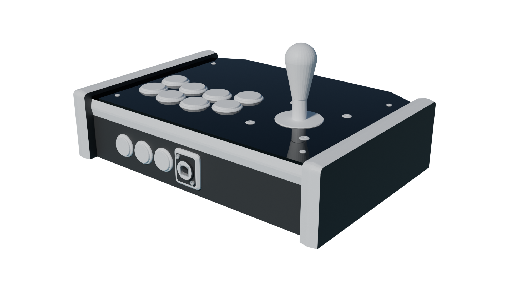

  

# Open-source 3D printable fightstick cases for the crafty warrior

Well... yeah that's about all there is to say. Peek the README files inside the folders for more info !

Goblin: Flatbox-style build  

Ikari: Tented ergonomic build

Ogre: American-style build

Ork: All-rounder compact build

Unhinged: Clamshell design for easy access to the internals

Wanderer: Cheap straightforward build

## TODO

- Ork:
    - Sega 2P lever mounts
    - Artwork cutouts
- Unhinged:
    - Sega 2P lever mounts
    - Artwork cutouts
- Ogre:
    - Artwork cutouts
- Goblin:
    - Split for 220x220mm build plate
    - Redo README
