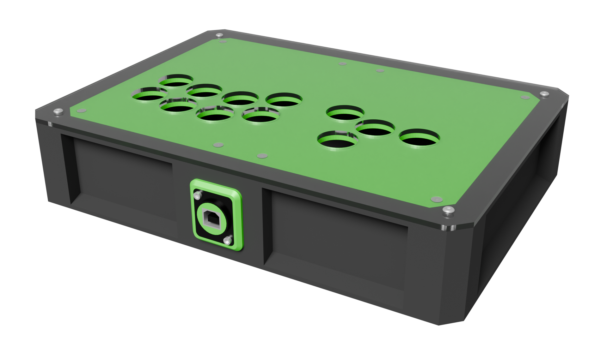

  

# Open-source 3D printable fightstick cases for the crafty warrior

A gaggle of case builds intended to be mostly 3D printed.

## How's it works

Builds are assigned (very subjective) stats on a scale of 1 to 5 vaguely describing what my own experience was putting them together:  

- **Printability**: How easy they are to print. Most of the time PLA is assumed to be the material of choice. 5 means if your machine squirts plastic it should work; 1 means you pretty much need a perfectly tuned printer to do it. Anything below 1 means it has only ever worked on my personal printers during what can be generously called a freak accident.
- **Buildability**: How easy they are to actually put together. 5 should be roughly equal to your average LEGO Technic build; 1 means you need a PhD in rocket surgery.
- **Extra hardware**: How much non-printed hardware and tools is needed to build (generally proportional to the price). **This only concerns the case itself; electronics are not considered part of it** (except when noted). 5 means you only need heat-set inserts and corresponding screws at best; 1 means you need to source some stuff that may be harder than average to get. (Do note that usually acrylic is considered "to taste" and doesn't factor into this particular note)
- and finally, **Price**: Because of course this is a deciding factor for a lot of people. 5/5 means it's super cheap to make; 1/5 means I had to sell my house to make it.

## The gallery

Goblin: Flatbox-style build  

Ikari: Tented ergonomic build

Ogre: American-style build

Ork: All-rounder compact build

Unhinged: Clamshell design for easy access to the internals

Wanderer: Cheap straightforward build

## TODO

- Ork:
    - Sega 2P lever mounts
    - Artwork cutouts
- Unhinged:
    - Sega 2P lever mounts
    - Artwork cutouts
- Ogre:
    - Artwork cutouts
- Goblin:
    - Split for 220x220mm build plate
    - Redo README
