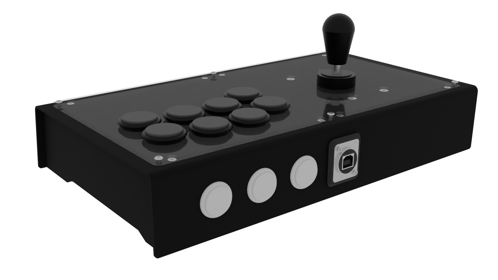

# T.T.E.O.K.B.O.K.K.I. Top Grade Case
## Also known as "We have [REDACTED] at home"

---

A case that I swear no one has ever seen around. Comes with a magnetically attached bottom plate (if you want it to; otherwise it's M3 Screw Land).

## The Stats

**Printability**: 4/5; You do need a setup that is particularly good at bevels and supports; I use tree supports for the frame  
**Buildability**: 4/5; Large, roomy case with plenty of internal space  
**Extra hardware**: 3/5; Does need a fair amount of screws, and also magnets  
**Price**: 4/5; The hardware drives the BOM up a little on this one but nothing too cray cray  

## Some context and questions I've been asked about it

A few months ago I made the [Raijin](https://github.com/superbad64/OpenFighter/tree/main/Personal%20Builds/Raijin) out of a desire to have a full-collar Korean build. Due to the frankly ludicrous BOM on it, I decided to revisit it, and the end result happened to be this very build.

For printability's sake I made one with full sides, instead of the recessed ones pictured above. The files for it are also available in the STL folder.

Do keep in mind that this was *supposed* to be filled, sanded, primed, and then painted to hide the joint seams; therefore some of the conception really does not account for a default "extruded plastic" look. (It works though, but that's more a happy accident than anything else)

## Parts list

Must be exactly matched:

- M3S Ruthex heat-set inserts:
    - 6 for the acrylic
    - 8 for the top panels
    - 8 more if you're using the screw-on bottom
- 1x A3-sized 2 or 3mm thick sheet of material to drill or laser cut for the top panel (acrylic, wood, brass, dry ice, aerogel...)

Exact match not needed except for dimensions:

- DIN 7991/ISO 10642 M3x8 hex socket countersunk screws for the top panel halves
    - 8 for the top panel halves
    - 8 more if you want the screw-on bottom panel
- 6x ISO 7380 M3x8 hex socket button head screws for the acrylic
- 4x DIN 7991/ISO 10642 M4x16 hex socket countersunk screws to mount the lever (if you choose to have one of course)
    - In a pinch, M3x16 also works as long as you're using a washer
- 2x DIN 912/ISO 4672 M3x30 hex socket head cap screws for the Neutrik
- M3 nuts and washers (just grab a handful)
- 8 or 12x 15 by 3 millimeters disc-shaped magnets if you want the magnetic bottom (I find 8 to be largely enough but you do you)
- 4x 6x30mm dowel rods (you can just print them anyway, they're just cylinders)

Tools && auxiliaries:

- Soldering iron
- Multi-purpose pliers to tighten all those nuts
- Neoprene glue/contact cement
- (Optional but **vigorously** recommended) *Long* ratcheting clamps
- (Optional but recommended) Medium strength threadlocker, aka blue Loctite(tm)

## Build guide

Print both frame halves and carefully remove the supports. Insert the dowels in the guiding holes and join the halves together, using neoprene glue.

> [!IMPORTANT]
> While I'm unsure of the exact effects of neoprene glue fumes on the human body/nervous system, it seems like a good idea to avoid spreading said glue too close to the holes into which a heat-set insert is going to be added in a few moments.

If you have some, use the ratcheting clamps to make sure everything is super tight (you shouldn't *need* to but it can't hurt). Let the glue cure for a day.

Add the heat-set inserts to the holes on the top side. Screw in the top panels of your choice using the inner holes (relative to each panel); the outer holes are for the acrylic.

Use some more neoprene glue to attach half of the the magnets to the frame. Whilst being mindful of the polarity, attach the other half to the bottom panels.

Join the three bottom panel parts together using... you guessed it, neoprene glue. After curing, you can plastic weld the non-glued parts to further improve stability.

## TODO

- Art && cut files

## Acknowledgements

- [Buttercade](https://www.etsy.com/shop/BUTTERCADE) for the Surround and Support project
- [The GP2040-CE project](https://gp2040-ce.info) for the GP2040-CE firmware
- Sega for the Virtua Stick High Grade
- By proxy, Etokki for the Omni
