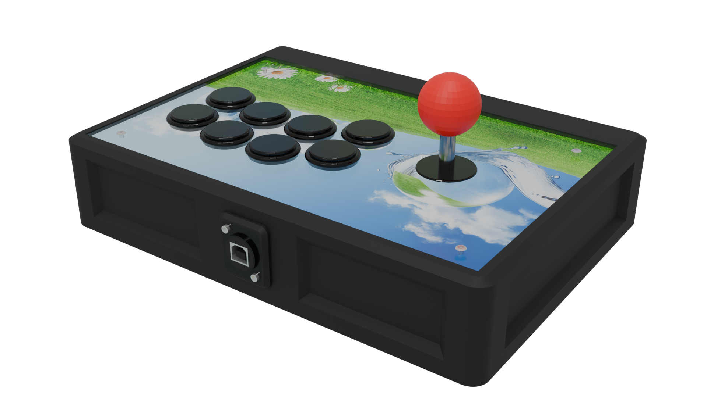

# The Unhinged
## Fabled clamshell design of legend

This compact build offers a clamshell design for easy access to the internals.

## Parts list

Must be exactly matched:

- At least 16x M3S Ruthex heat-set inserts (I haven't tested other ones, and I know *those* work):
    - 6 for the bottom panel
    - 2 for the door catch
    - 8 for the hinge bases
    - Add 4 more if you're using a lever
- 1x Neutrik NA-USB
- Door ball catch, 40mm long, with M4 holes 34mm apart (center to center)
- 1x A4 sized 3mm thick sheet of material to laser cut for the top panel (acrylic, wood, brass...)

Exact match not needed except for dimensions:

- 4x ISO 7380 M3x8 hex socket button head screws for the acrylic
- 6x DIN 7991/ISO 10642 M3x8 hex socket countersunk screws for the bottom panel
- 2x DIN 912/ISO 4672 M3x8 hex socket head cap screws for the door catch (the holes are M4 but the wider head works to hold it down fine)
- 6x DIN 912/ISO 4672 M3x25 hex socket head cap screws for the hinges (technically you need 4 M3x25 and 2 M3x10)
- 2x DIN 912/ISO 4672 M3x30 hex socket head cap screws for the Neutrik
- 12x DIN 934/ISO 4032 M3 hex nuts:
    - 4 for the top panel
    - 6 for the hinges
    - 2 for the Neutrik

Tools && auxiliaries:

- Soldering iron
- (Optional but recommended) Neoprene glue/contact cement. CA glue should work too
- (Optional but recommended) Medium strength threadlocker, aka blue Loctite(tm)

## Build guide

Print all parts of the frame (`left`, `right`, `centerfront` and `centerback` STLs), and 12 `dowel`. Join the parts together, using adhesive if you want to make sure the frame will not come apart under any circumstance. You can also weld the inner seams together. Add heat-set inserts to the 8 relevant holes (6 on the bottom, 2 on the center back joiner piece). Screw the door catch into the center back joiner piece.

Print the bottom panel pieces (`bottomleft` and `bottomright`) and screw them to the frame. Optionally weld them on the inside and/or apply adhesive to the lap joints.

Print the hinge pieces and assemble them: use an M3x25 screw and M3 nut to attach the base to the short arm, then a M3x10 to attach the short arm to the long arm. Bolt the hinge to the frame using M3x8 screws. Repeat for the other hinge.

Print the top panel pieces with the layout of your choice, and once again, optionally weld them on the inside. Attach the hinges to the top panel using M3x25 screws.

Next, print the `pin` file from the `Top` directory. This is the piece that will mate with the door catch, so I suggest printing it sideways, so the layer lines run perpendicular to the force vector applied when opening the case.

If you already have your laser cut acrylic (or wood or whatever else), mount it to the top panel.

Print the bezel pieces; use the aforeprinted pin piece and the laser cut plate as guides to glue them to the top panel.

## Acknowledgements

- [Buttercade](https://www.etsy.com/shop/BUTTERCADE) for the Surround and Support project
